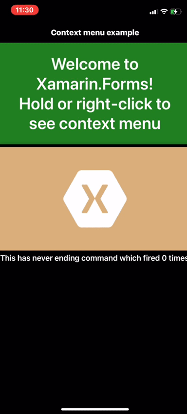
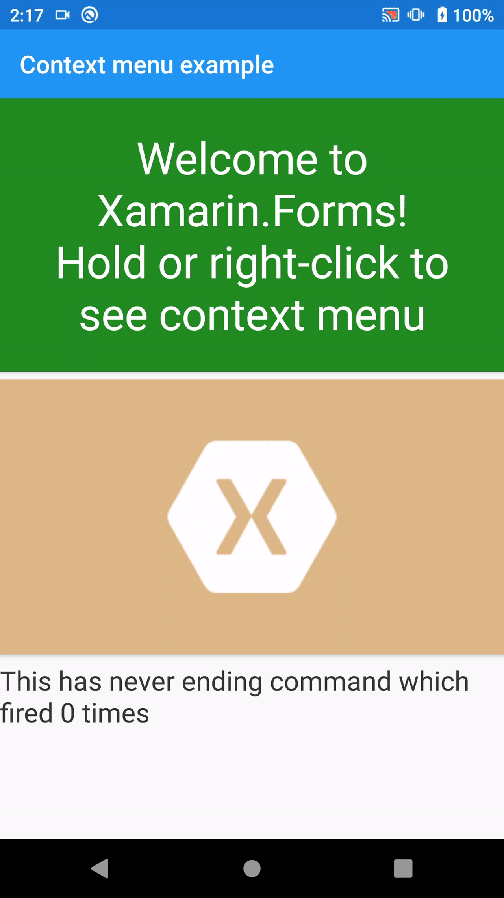
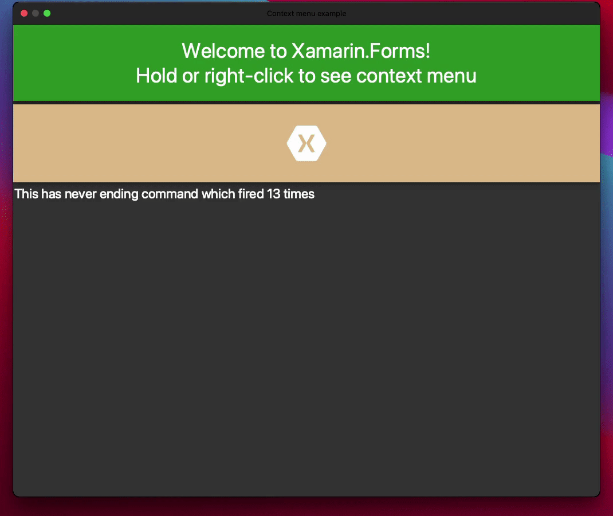
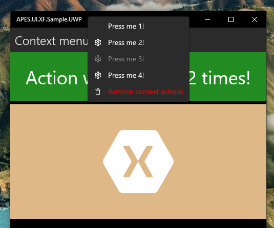

# ContextMenuContainer
[](https://www.nuget.org/packages/ContextMenuContainer/)

Add native context menu to any Xamarin.Forms view. Supports UWP, Android, iOS and macOS.
iOS | Android | macOs | UWP
:-------------------------:|:-------------------------:|:-------------------------:|:-------------------------:
 |  |  | 
## How to use
1. Add namespace to your XAML file 
    `xmlns:c="http://apes.ge"`
2. Wrap your view with `ContextMenuContainer`, define your context actions inline or bind from your ViewModel
```
//Inline
<apes:ContextMenuContainer x:Name="ActionsInline">
    <apes:ContextMenuContainer.MenuItems>
        <apes:ContextMenuItem Text="My action" Command="{Binding MyCommand}" CommandParameter="{Binding .}" />
         <apes:ContextMenuItem Text="My destructive action" Command="{Binding MyDestructiveCommand}" CommandParameter="{Binding .}" IsDestructive="True" Icon="{Binding DestructiveIconSource}"/>
    </apes:ContextMenuContainer.MenuItems>
    <apes:ContextMenuContainer.Content>
        <Label Text="Hold me!"/>
    </apes:ContextMenuContainer.Content>
</apes:ContextMenuContainer>
//From binding
<apes:ContextMenuContainer x:Name="ContextActionsWithBinding" MenuItems="{Binding ImageContextItems}">
    <apes:ContextMenuContainer.Content>
        <Frame>
            <Image Source="{Binding IconSource}"/>
        </Frame>
    </apes:ContextMenuContainer.Content>
</apes:ContextMenuContainer>
```

## Icons 
Cross-platform icons are really messy at this point, but you can put your assets to the coresponding folder on each platform and then bind to a `FileIconImageSource` from your ViewModel. Please refer to the sample folder for example. SVG is preferable.
## Known issues 
- Using it in a `ViewCell` template of `ListView` might lead to issues with recognizing tap/select events from the list itself, so you might consider using TapGestureRecognizer on the template instead

## To-Do
- [ ] Less hacky Android implementation
- [ ] Cover it all with tests
- [ ] Configure build scripts
- [ ] Add visibility property 
- [ ] Add highlight property 
- [ ] Add support for shortcuts 
- [ ] Add support of accessability features
- [ ] Add support for submenus and separators
- [ ] Add font icons


